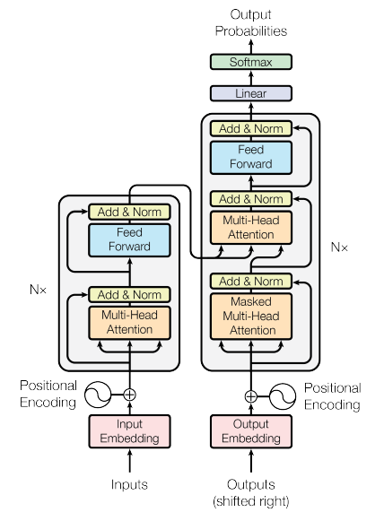
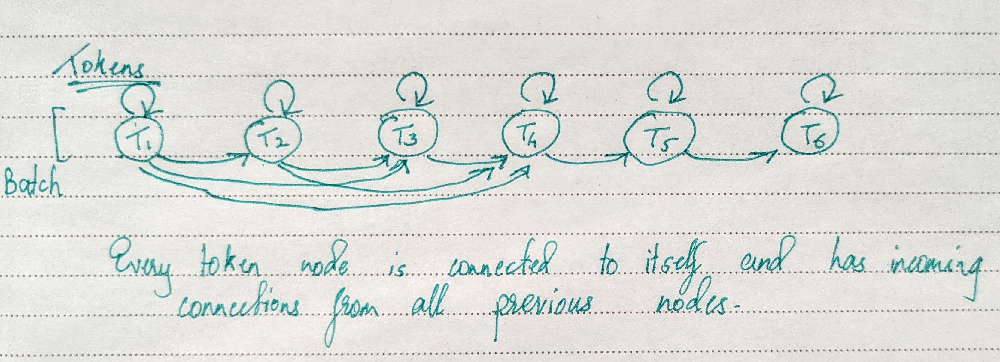
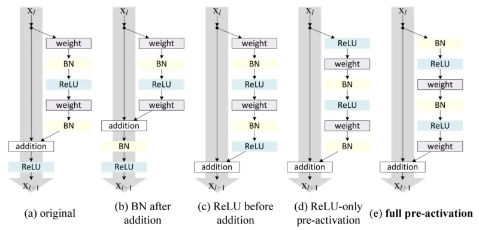
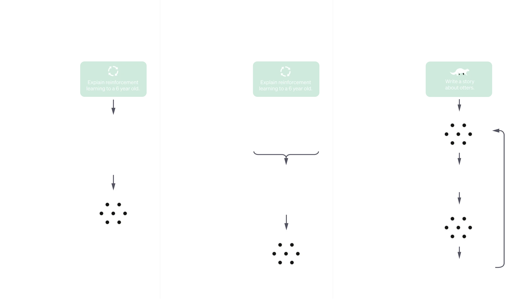

# Micro GPT

## Dataset

- The shakespear dataset contains `1,115,394` characters that makes up a vocab size of `65`

## Tokenizer and De-tokenizer

- There are many tokenizers and detokenizers out there that encode string into list of ints and list od ints back to string. There are many schemas to do this.
- For example, Google uses SentencePiece
[SentencePiece](https://github.com/google/sentencepiece), OpenAI uses Tiktoken
[Tiktoken](https://github.com/openai/tiktoken)
- We will just use normal mapping of string to int and vice versa for now.

- `The vocab_size and encoding output are inversly proportional`. If the vocab size is small, you wll have a longer sequence of encodings. For example "hii there" --> [46, 47, 47, 1, 58, 46, 43, 56, 43] in our character level tokanizer with vocab_size of 65. If you use the GPT-2 tokenizer Tiktoken, the encoind will be "hii there" --> [71, 4178, 612] since the vocab_size is 50,257.

## Creating the Batches

- dim 1 -> Batch dim
- dim 2 -> Block_size dim (8)
- So one training example is Input of [1, 8] and output of [1, 8].
- x[0] is the first character, y[0] is the expected output if feeded x[0].
- y[5] is the output expected when I feed x[0:5] and this output is also x[6] basically.
- Example - 
When input is [50] output is 42
When input is [50, 42] output is 1
When input is [50, 42, 1] output is 40
When input is [50, 42, 1, 40] output is 43
When input is [50, 42, 1, 40, 43] output is 1
When input is [50, 42, 1, 40, 43, 1] output is 53
When input is [50, 42, 1, 40, 43, 1, 53] output is 59
When input is [50, 42, 1, 40, 43, 1, 53, 59] output is 56

- `[B, T, C]` refers to Batch, Time, Channels dimensions.

## AdamW Optimizer

- An optimizer initialized with model parameters and learning rate and after doing losss.backward() you perform `optimizer.step()`

## Self-Attention Block

- Basically we want the tokens to talk to each other instead of Bigram taking only previous character info.

- Dimension -> [B, T, C] Batch, Time series, Channels

- If we take 5th token (Time series) we want this to talk to only the previous tokens and nothing in the future. (Becasue that needs to be predicted).

- The Simplest way to communicate is to take channels of this and all previous tokens and average them out to have an overall information for this particular token. Now this losses lots of spacial information and not good communicating. But a good start.

## Matrix multiplication as weighted aggregate of tokens

- We could use two for loops first going through batches and second going through Time dimensions.
- We then extract the required sub-torch ([b, :t+1]) and mean across the 1st dim and keep doing this.
- Obviously this method is super slow and we want to convert this to matrix multiplication.

- Suppose we take a A = [3, 3] matrix and multiply it with a B = [3, 2] matrix the result is a C = [3, 2] matrix.
- Now, the first value of the result came from first row of A and first column of B.
- Example -> 

A = [1, 1, 1],
    [1, 1, 1],
    [1, 1, 1]

B = [2, 7],
    [6, 4],
    [6, 5]

C = A @ B becomes   [14, 16],
                    [14, 16],
                    [14, 16]

`If any row of A is just ones, then C basically gets the sum across rows`

- Now we we change the A matrix be be `a triangle matrix`-

A = [1, 0, 0],
    [1, 1, 0],
    [1, 1, 1] using torch.tril(torch.ones(3,3))

C = A @ B becomes   [2, 7],
                    [8, 11],
                    [14, 16]

`8 and 11 are basically instead of summing across all the rows, only summing across that row and above`

- Now we we change the A matrix be be `a triangle matrix with mean across columns`-

A = [1.0, 0, 0],
    [0.5, 0.5, 0],
    [0.33, 0.33, 0.33] using torch.tril(torch.ones(3,3))

A = A / A.sum(1, keepdim = True)

C = A @ B becomes   [2.0, 7.0],
                    [4.0, 5.5],
                    [4.66, 5.33]

`4.0 and 5.5 are now the average of values in that row and above rows of B  -->> Exactly what we wanted`

<b>`So here the A matrix can be thought of like a MAsk or weight deciding how much value to give to which previous token`</b>

B, T, C = 4, 8, 3

Random trial batch of inputs of shape [B,T,C]
x = torch.randint(1, 65, (B, T, C)).float()     # B,T,C --> 4,8,3
print(x.shape)

A Lower triangle 1.0
tril = torch.tril(torch.ones(T, T))
Initializing weights to zero
wei = torch.zeros_like(tril).float()
Preventing Future tokens talking to current and past tokens
wei = wei.masked_fill(tril == 0, float('-inf'))
Normalizing to get averages across time dimension
wei = wei.softmax(dim = -1)
Talking of weights with the input
y = wei @ x     # [T,T] @ [B,T,C] -> [B,T,C]

`The weights are initialized to zero, then we prevent future tokens talking and then we do a softmax to get average. You see how you can tune the weights based on the input data to find out which past token is how much important to this current token and change the weights accordingly`

## Self Attention Head

- We have seen that the values of this wei matrix show how much other past tokens are important for the current token.
- But instead of keeping them at all zero, wei is derived by performing a self attention head block.

#### Block

<b>`Attention Mechanism is the way of communication between nodes in general. Where every node can aggregate a weighted sum of information from all the other nodes that are incoming to this current node`</b>

`In our case, the graph looks like this`

Unlike convolution, the nodes here no idea about the space(positioning) so we need to explicitely provide position embedding.

- An `Decoding Attention Block` is what we have designed where based on past tokens it decodes what the next token is. So we add masking to prevent future tokens to talk to current token.
- An `Encoding Attention Block` is the one without masking where any given token talks to all other tokens, including future tokens. Used to sentiment analysis or translation.

- Why `Self-Attention`? Because the Keys, Queries and Values all come from the same source (x) input.
- In `Cross-Attention`, key would come from this x source but query and value would come from feedforwarding on a different source. And the other souce could be an encoding-attention block to to capture sentiment information from that source and quering with this source.

- Extract B,T,C dimensions from input. And another hyperparaeter `head_size` (32)
- We initialize Three nn.Linear layers called `key`, `query` and `value`. All of this take input of size C->channels and output of size head_size.
- The input [B,T,C] is passed through the key and query layer to get outputs k and q of size `[B, T, head_size]`
- Now the weight matrix is a dot product of q and k. [B,T, head_size] dt with [B, T, head_size]. So we transpose the second value wrt last two dimensions. So the key dim -> [B, head_size, T] which results in a dot product of `[B, T, T]`. Which is indeed our weight matrix telling us how much other tokens contribute.
- The variance of this roughly equals the head_size and this is going to later be fed to a softmax and we know softmax should have a relatively uniform distribution instead of high peaks that will make one value very high. So we divide the values by `(1.0/C**0.5)` as suggested in the paper.
- Once we get this wei matrix now, we mask it to prevent future tokens to communicate, and perform a softmax across columns to get normalized weights as before.
- Now instead of doing a dot product of this wei matrix with the input data directly, we pass the data through the value layer to get an output v of dim [B,T,head_size].
- Then we finally do matrix multiplication of `wei @ v`.

Query -> Asking a question if anyone has this xyz
key -> Answering that query yes I have that
Dot_product -> High value to similar vectors, low value to opposite vectors. This is the communication between tokens established. 

## Embedding and Positional Embedding

- We first have the embedding table that converts inputs [B, T] to [B, T, C] so this takes input of vocab_size and outputs n_embid.
- Next with the token encodings, we also want the position encodings. We have another encoding matrix called position_encoding and that converts inputs [position Token] and outputs position encoding for that table. So its input is [block_size] and output is [n_embid](32) which is same as embedding table.
- Finally we add both to get final enbeddings. [B,T,C] + [T,C]

## Attention Blocks followed by Linear blocks

- Attention blocks are blocks where the communication with other tokens happens and finally each token gets a new value based on what it hs learned from others
- This is followed by a Linear layer where these new token values are processed and allowed to think on individually before they can again communicate.

## Residual Connection or Skip connection

- Residual block allow a skip connection while doing deep computation. While merging, you just add the skip connection outputs to computation network output.
- `Remmeber how during backpropagation, addition just distributes the gradients??? And also that multiple gradients coming from a chain just gets add up??` Well because of this skip connection, we populate the gradient at the start of the skip connection and also add gradients coming from the computational branch. Pretty neat!!
- In the beginning only the skip connections are mostly active and the gradients just flow right through the input. And over time of optimization the computational block kicks in.
- There is always a project layer at the end of computational path to make it's channel equal to the start of the skip connection so that they can be added.

## Layer Normalization

- Very similar to BatchNorm where BatchNorm normalizes over one partcular batch (`In other words, it normalizes across the row which is the batch dimension`). Therefore every batch coming out will have 0 mean and 1 std; unit gaussian.
- Layer normalization normalizes across the column dimension instead of batch dimension. (`One batch won't be a unit gaussian butt one particular example is unit gaussian.`)
- We therefore don't need to maintain running mean and std values for test time.
- Basically a batch norm normalizes the columns and a layer norm normalizes the rows.

> :bulb: **Tip**: Recent advancements in transformers have changed adding of the layer normalization before the attention layer and mlp layer instead of after the layers in the original paper.

## Dropouts

- Given a probability, randomly makes some values of the input tensor as zeros. Has a regularization effect.
- We use dropouts-
    - After feedforward (computational) layer's outputs
    - After MultiHead Attention layer
    - After Softmax inside a single Head (randomly prevet some token to communicate)

> :bulb: **Tip**: Dropouts are disable during test time and everything contributes.

## GPT-3

- Multiple models from 125 million to 175 Billion parameters
- Al models are trained on 300 Billion token
- GPT-3 parameters - layers -> 96, embedding -> 12288, n_heads -> 96, so the head_size becomes -> 128, batch_size -> 3.2 million, learning_rate in the e-4 scale, block_size (token size) -> 4096

- That compared to our model-

- Our model has 10 million parameters
- Our models is trained on roughly 300 thousand tokens in the dataset (1.1 million tokens in real)
- Our model - layers -> 6, embedding -> 384, n_heads -> 6, so the head_size becomes -> 64, batch_size -> 64, learning_rate in the 3e-4 scale, block_size (token size) -> 256

# GPT training process

- We coded a `DECODER` attention network (masked). Only allowed to see the past and learn the future predictions.
- By training this, we can give the model a start and then it will blabber similar text. This will be random and it will just keep on predicting what will come next. This is not how ChatGPT works. If I give my `decoder` model a question, it will probably just give me more questions lol or something random based on it's learning.
- To make it more like an assistant, we need to fine-tune the model after this `pretraining` step that we did.
- After we have the base model, ChatGPT is finetuned with -
    - They have a prompt dataset which is 1000s of data of the question prompts people will give.
    - A prompt is sampled from it and then a labeler demonstrates how the output should be like for this prompt.
    - Then this data is used to fine tune the model...optimize it to understand the question and answer scenario.
    - They also train a reward model where it outpus multiple answers and then a human labeler ranks them from best to worst.
    - Finally they run a reinforcement learning to optimize the reward function using the PPO reinforcement learning algorithm.
- This is how a model is turned from a document completer to a question-answer model.

# AND.....THIS IS AI REALLY.